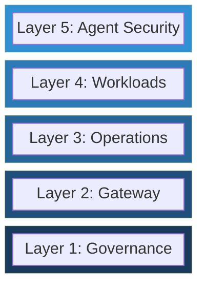

# GenAI Adoption Framework (GAF)

The GenAI Adoption Framework (GAF) is a vendor-agnostic, theoretical framework for planning, governing, and scaling generative AI adoption across the enterprise. It provides a structured approach to the organizational, architectural, and security concerns that emerge when generative AI moves from experimentation to production. GAF defines five stacking capability layers, three maturity stages, and a set of cross-cutting concerns that together form a comprehensive blueprint for responsible, secure, and operationally sound GenAI adoption. The framework is intentionally free of product or vendor references; it describes *what* an enterprise needs, not *how* to procure it.

---

## Architecture: The Five Stacking Layers

Each layer builds on the one below it. This is a deliberate design choice: higher layers assume the capabilities of lower layers are in place. Skipping a layer creates structural risk.



### Layer 1: Governance

Establishes the policy foundation -- data classification, acceptable use policies, regulatory mapping, and oversight structures -- that every subsequent layer depends on.

### Layer 2: Gateway

Provides a centralized control plane for model access, request routing, policy enforcement, and rate management so that all generative AI traffic flows through a governed boundary.

### Layer 3: Operations

Delivers the observability, security operations, cost management, and developer enablement capabilities required to run generative AI workloads reliably in production.

### Layer 4: Workloads

Covers the discipline of scoping individual use cases, selecting and evaluating models, conducting adversarial testing, and managing prompt and retrieval pipelines.

### Layer 5: Agent Security

Addresses the unique security surface of autonomous and semi-autonomous agents -- identity, fine-grained authorization, tool-use control, and immutable audit trails.

---

## Maturity Stages

GAF defines three maturity stages that describe an organization's progression from initial adoption to optimized operations.

| Stage | Name | Description |
|-------|------|-------------|
| 1 | **Foundation** | Minimum viable platform: core governance policies are defined, a gateway exists, and basic observability is in place to support initial production workloads. |
| 2 | **Operational** | Production-ready posture: policy enforcement is automated, operations are instrumented end-to-end, workloads follow a standardized lifecycle, and security controls cover both model and agent interactions. |
| 3 | **Optimized** | Mature, continuous-improvement state: governance adapts dynamically to new regulations and threat models, cost and performance are actively optimized, and the organization operates a feedback loop between workload outcomes and platform capabilities. |

---

## Quick Navigation

| Section | Path |
|---------|------|
| Framework Overview | [docs/overview.md](docs/overview.md) |
| Design Principles | [docs/principles.md](docs/principles.md) |
| Glossary | [docs/glossary.md](docs/glossary.md) |
| Layer 1 -- Governance | [docs/layers/01-governance/](docs/layers/01-governance/) |
| Layer 2 -- Gateway | [docs/layers/02-gateway/](docs/layers/02-gateway/) |
| Layer 3 -- Operations | [docs/layers/03-operations/](docs/layers/03-operations/) |
| Layer 4 -- Workloads | [docs/layers/04-workloads/](docs/layers/04-workloads/) |
| Layer 5 -- Agent Security | [docs/layers/05-agent-security/](docs/layers/05-agent-security/) |
| Maturity Model | [docs/maturity-model/](docs/maturity-model/) |
| Cross-Cutting Concerns | [docs/cross-cutting/](docs/cross-cutting/) |
| Reference Architectures | [docs/reference-architectures/](docs/reference-architectures/) |
| Checklists | [docs/checklists/](docs/checklists/) |
| Lenses | [docs/lenses/](docs/lenses/) |

---

## How to Use This Framework

GAF is designed to serve multiple audiences. Start where your role demands the most clarity.

**Chief Technology Officer / VP of Engineering** -- Begin with the [Framework Overview](docs/overview.md) and the [Maturity Model](docs/maturity-model/). These sections map organizational readiness to concrete capability milestones and provide the vocabulary needed for executive alignment and investment planning.

**Platform Engineer / Infrastructure Architect** -- Start with Layer 1 (Governance) and Layer 2 (Gateway), then work upward through Operations. The [Reference Architectures](docs/reference-architectures/) provide structural patterns, and the [Checklists](docs/checklists/) offer stage-gate criteria you can integrate into your delivery process.

**Security Architect / CISO Office** -- Focus on the [Cross-Cutting Concerns](docs/cross-cutting/) and Layer 5 (Agent Security), then review each layer's security controls. The [Lenses](docs/lenses/) provide role-specific views that map framework capabilities to security and compliance objectives.

Regardless of role, read the layers in order from 1 to 5. The stacking architecture means that each layer's guidance assumes the prior layer is understood.

---

## Relationship to Implementations

GAF is a **theoretical framework**. It describes capabilities, patterns, and decision points without prescribing specific technologies. Separate implementation guides exist that reference concrete tools, services, and configurations aligned to particular technology ecosystems. Those guides depend on GAF for structure and terminology; GAF does not depend on them. This separation ensures the framework remains durable across technology shifts and organizational contexts.

---

## Contributing

Contributions are welcome. Please read [CONTRIBUTING.md](CONTRIBUTING.md) for guidelines on proposing changes, reporting issues, and submitting pull requests.

---

## License

This work is licensed under the [Apache License 2.0](LICENSE).

```
Copyright 2026 Odovey Consulting

Licensed under the Apache License, Version 2.0 (the "License");
you may not use this file except in compliance with the License.
You may obtain a copy of the License at

    http://www.apache.org/licenses/LICENSE-2.0

Unless required by applicable law or agreed to in writing, software
distributed under the License is distributed on an "AS IS" BASIS,
WITHOUT WARRANTIES OR CONDITIONS OF ANY KIND, either express or implied.
See the License for the specific language governing permissions and
limitations under the License.
```
