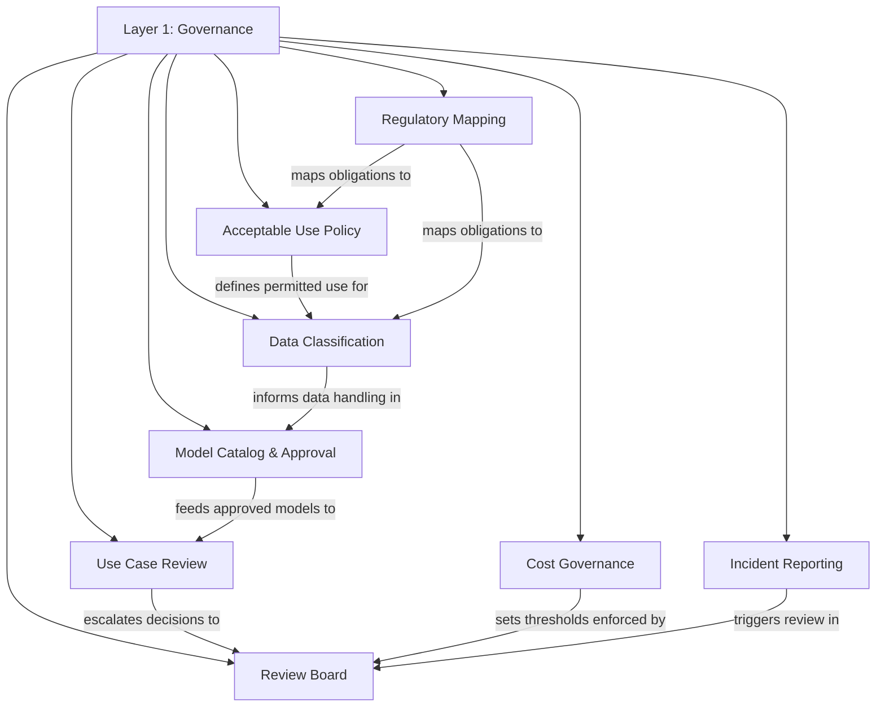

# Layer 1: Governance

Governance is the operating agreement that gives a generative AI platform its legitimacy. It is not a bureaucratic gate that slows teams down; it is the set of explicit, written decisions that determine what the platform enforces, what teams are permitted to do, and how the organization responds when something goes wrong. Every technical control in the layers above this one traces its authority back to a governance decision made here. Without governance, a gateway is just a proxy with opinions. With governance, it is a policy-enforcement engine that the business trusts.

---

## Why This Layer Matters

Organizations that skip governance and jump straight to deploying infrastructure discover the same pattern within months: shadow usage proliferates, sensitive data leaks into external model providers, costs spiral without accountability, and leadership loses confidence in the program. The resulting crackdown is almost always more restrictive than the governance framework would have been if it had existed from the start.

Governance matters because it converts organizational risk appetite into actionable rules. It answers questions that technology alone cannot: Which data classifications are permitted in prompts? Who approves a new model before it enters production? What constitutes an incident, and who gets notified? What spending thresholds trigger review? These are business decisions, not engineering decisions, and they must be made deliberately rather than discovered after a breach or budget overrun.

A well-designed governance layer also creates velocity. When teams know the boundaries, they stop asking for permission on every request and start building. Clear acceptable-use policies, a published model catalog, and a transparent use-case review process remove ambiguity. Teams move faster inside known constraints than they do inside undefined ones.

---

## Relationship to the Layer Below

Governance is the foundation layer. There is nothing beneath it in this framework. It depends on the organization's existing risk management, legal, compliance, and information security functions. It integrates with enterprise data classification standards, regulatory obligations, and corporate policies that predate the generative AI program. This layer translates those broader organizational commitments into specific, enforceable rules for generative AI usage.

---

## Relationship to the Layer Above

Layer 2, the Gateway, is the technical enforcement point for governance decisions. Every policy defined here must be implementable as a control in the gateway or in the operational processes that surround it. The acceptable-use policy becomes content-filtering rules. Data classification decisions become DLP configurations. The model catalog becomes the model registry. Cost governance thresholds become budget-enforcement logic. If a governance decision cannot be enforced technically or operationally, it is aspirational rather than real, and this layer must acknowledge that gap explicitly.

---

## Key Outcomes When This Layer Is Implemented Well

- **Clarity of boundaries.** Every team knows what they can and cannot do with generative AI without filing a ticket to find out.
- **Defensible decision-making.** When regulators, auditors, or executives ask why a particular model or use case was approved, there is a documented rationale.
- **Controlled model proliferation.** New models enter the environment through a defined catalog and approval process rather than through individual developer experimentation.
- **Data protection by design.** Data classification rules prevent sensitive information from reaching external providers before the request ever leaves the organization.
- **Cost predictability.** Spending thresholds, chargeback models, and budget owners are defined before the first production workload ships.
- **Incident readiness.** The organization knows what constitutes a generative AI incident, who responds, and what the escalation path looks like before an incident occurs.
- **Regulatory alignment.** Obligations from relevant regulations and industry standards are mapped to specific controls, and gaps are tracked with remediation timelines.
- **Stakeholder trust.** Legal, compliance, security, and business leadership treat the generative AI program as managed risk rather than unmanaged experimentation.

---

## Internal Structure

**Acceptable Use Policy** codifies what constitutes permitted and prohibited use of generative AI across the organization. It addresses data handling, output usage, human oversight requirements, and prohibited use cases.

**Data Classification** extends the organization's existing data classification scheme to generative AI contexts, defining which classification levels may be included in prompts, fine-tuning datasets, and retrieval-augmented generation corpora.

**Model Catalog & Approval** maintains the authoritative list of models approved for use, including their risk ratings, approved use cases, and any constraints on deployment topology.

**Use Case Review** provides a structured process for teams to submit new generative AI use cases for evaluation against risk, feasibility, and value criteria before development begins.

**Cost Governance** establishes budget ownership, spending thresholds, chargeback mechanisms, and escalation procedures for cost overruns.

**Review Board** is the cross-functional body (typically spanning engineering, security, legal, privacy, and business leadership) that makes approval decisions on models, use cases, and policy exceptions.

**Incident Reporting** defines what constitutes a generative AI incident (data leakage, harmful output, model misbehavior, availability failure), the reporting channel, severity classification, and response procedures.

**Regulatory Mapping** tracks relevant regulations, industry standards, and contractual obligations, mapping each requirement to one or more governance controls and identifying gaps.

---

## Navigation

- [Principles](./principles.md) -- Core beliefs that guide governance design decisions
- [Capabilities](./capabilities.md) -- Detailed breakdown of each governance capability
- [Best Practices](./best-practices.md) -- Patterns observed in mature governance implementations
- [Anti-Patterns](./anti-patterns.md) -- Common failure modes and how to avoid them
- [Decision Guide](./decision-guide.md) -- Flowcharts and criteria for key governance decisions

---

*[Back to Framework Overview](../../../README.md) | [Next: Layer 2 -- Gateway](../02-gateway/README.md)*
