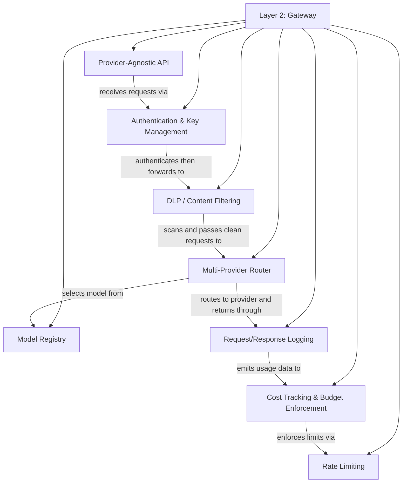

# Layer 2: Gateway

The gateway is the platform's center of gravity. Every request from every team, every application, and every agent passes through it. It is the single control point where governance decisions become technical enforcement, where provider complexity is abstracted away, and where the organization gains unified visibility into all generative AI activity. Without a gateway, governance is a document that nobody reads. With a gateway, governance is a system that nobody bypasses.

---

## Why This Layer Matters

The fundamental challenge of operating generative AI at scale is that models are accessed through external APIs with usage-based pricing, variable performance characteristics, and evolving capabilities. Individual teams managing their own provider relationships leads to fragmentation: inconsistent security controls, duplicated authentication credentials scattered across repositories, no aggregate cost visibility, and no ability to enforce organizational policy uniformly.

The gateway solves this by interposing a single layer between all internal consumers and all external (or internal) model providers. It authenticates callers, routes requests to the appropriate model, logs every interaction, enforces budgets, applies content-filtering rules, and presents a consistent API regardless of which provider serves the request. Teams interact with one interface. The platform team manages provider relationships centrally. Security and compliance get a single audit stream.

This layer matters because it converts a collection of point-to-point integrations into a managed platform. That shift is what makes organizational scale possible. It is also what makes every layer above this one viable: operations cannot observe what it cannot see, workloads cannot be evaluated without logged interactions, and agent security cannot enforce tool-level authorization without a control point.

---

## Relationship to the Layer Below

The gateway enforces Layer 1. Every rule in the acceptable-use policy, every data-classification constraint, every model-approval decision, and every cost threshold defined in governance must have a corresponding technical implementation in the gateway. The model registry is the runtime manifestation of the model catalog. Content-filtering rules implement the acceptable-use policy. Budget enforcement implements cost governance thresholds. The gateway does not make policy; it executes policy. When the gateway lacks a control that governance requires, that gap must be escalated back to governance as an accepted risk or addressed through operational compensating controls in Layer 3.

---

## Relationship to the Layer Above

Layer 3, Operations, depends entirely on the telemetry, logs, and metadata that the gateway produces. Observability dashboards are built from gateway metrics. Cost governance reporting aggregates gateway billing data. Security operations tune guardrails based on gateway content-filtering logs. Audit and compliance reporting draws from the gateway's request/response log. The gateway is the primary data source for the operational layer. If the gateway does not emit the right telemetry, operations is blind.

---

## Key Outcomes When This Layer Is Implemented Well

- **Single control point.** Every generative AI request traverses one enforcement layer, eliminating shadow access paths and inconsistent controls.
- **Provider abstraction.** Teams code against one API. Switching providers, adding new models, or negotiating new contracts requires no changes to consuming applications.
- **Unified authentication.** Callers authenticate to the gateway with organizational identity. Provider credentials are managed centrally and never distributed to individual teams or applications.
- **Comprehensive logging.** Every request, response, latency measurement, token count, and cost estimate is captured in a single, structured log stream.
- **Cost enforcement.** Budgets are enforced in real time. Teams, projects, or applications that exceed their allocation are throttled or blocked before the invoice arrives.
- **Content safety.** Data-loss prevention rules, content filters, and prompt-injection defenses are applied uniformly to all traffic, not left to individual teams to implement.
- **Rate protection.** Rate limiting prevents any single consumer from degrading the platform for others and protects the organization from unexpected cost spikes.
- **Operational agility.** Failing providers can be rerouted transparently. New models can be introduced without consumer changes. Capacity can be managed centrally.

---

## Internal Structure

**Model Registry** is the runtime source of truth for which models are available, their provider endpoints, capability metadata, cost-per-token rates, and any use-case restrictions inherited from the governance model catalog.

**Multi-Provider Router** selects the target model and provider for each request based on the caller's entitlements, the requested model, availability, latency requirements, and failover rules. It enables transparent provider switching and load distribution.

**Authentication & Key Management** validates the caller's identity against organizational identity systems, maps the caller to entitlements and budget allocations, and injects provider-specific credentials into outbound requests. No provider key is ever exposed to a consumer.

**Request/Response Logging** captures a structured record of every interaction, including timestamps, caller identity, model used, token counts, latency, and optionally prompt and response content (subject to data-classification rules from governance).

**Cost Tracking & Budget Enforcement** computes the cost of each request using token counts and model-specific rates, aggregates spending by team, project, and application, and enforces budget thresholds through warnings, throttling, or hard blocks.

**Rate Limiting** protects the platform from abuse and runaway automation by enforcing request-per-minute and token-per-minute limits at the caller, team, and organizational levels.

**DLP / Content Filtering** inspects prompts and responses for sensitive data patterns, prohibited content categories, and prompt-injection signatures. It blocks or redacts content that violates governance policy before the request reaches a provider.

**Provider-Agnostic API** presents a unified interface to all consumers, normalizing request and response formats across providers so that consuming applications are decoupled from provider-specific schemas.

---

## Navigation

- [Principles](./principles.md) -- Core design principles for gateway architecture
- [Capabilities](./capabilities.md) -- Detailed specification of each gateway capability
- [Best Practices](./best-practices.md) -- Patterns for reliable, scalable gateway operation
- [Anti-Patterns](./anti-patterns.md) -- Pitfalls that undermine the gateway's value
- [Decision Guide](./decision-guide.md) -- Build vs. assemble vs. buy and configuration trade-offs
- [Reference Architecture](./reference-architecture.md) -- Deployment topology, component interaction, and integration patterns

---

*[Previous: Layer 1 -- Governance](../01-governance/README.md) | [Back to Framework Overview](../../../README.md) | [Next: Layer 3 -- Operations](../03-operations/README.md)*
