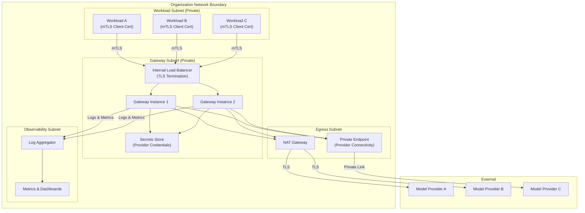
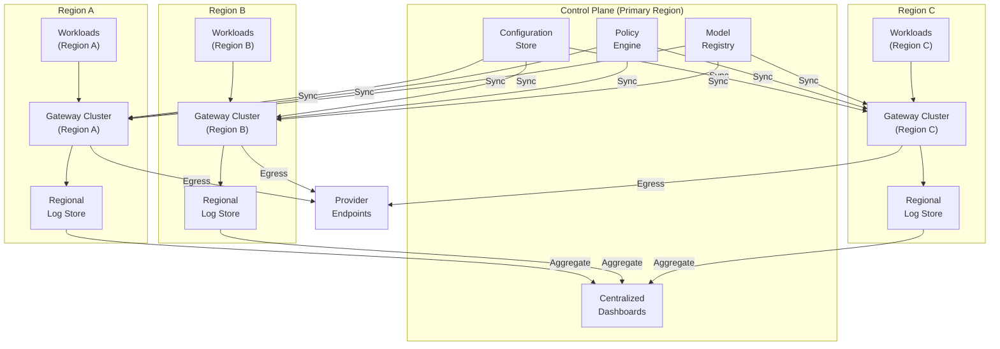
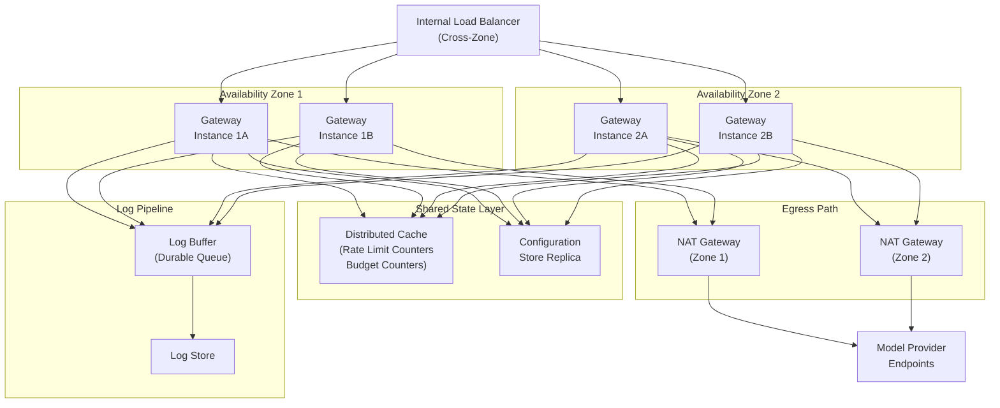

# Gateway Reference Architecture

This document provides reference architectures for the gateway layer, expressed as logical diagrams with narrative explanations. All labels are functional — no product names or vendor references appear. These diagrams are starting points; every organization will adapt them to its network topology, compliance requirements, and operational maturity.

---

## 1. Logical Network Diagram

The gateway sits in a private subnet with no direct internet ingress or egress. Workloads reach the gateway over the internal network using mTLS. The gateway reaches model providers through a controlled egress path — either a NAT gateway or a private connectivity endpoint.

**Design decisions:**

- **Internal load balancer:** Distributes traffic across gateway instances without exposing a public endpoint. Health checks ensure that requests are only routed to healthy instances.
- **Separate egress subnet:** Isolates the NAT gateway and private endpoints from the gateway compute instances. This allows network-level access controls that restrict which subnets can reach the egress path — only the gateway subnet, never the workload subnets directly.
- **Secrets store in the gateway subnet:** Provider credentials are accessible only to gateway instances. Workload subnets have no network path to the secrets store.
- **Dedicated observability subnet:** Log and metrics infrastructure is isolated so that a compromised workload cannot tamper with audit records.

---

## 2. Gateway Internal Component Diagram

This diagram shows the internal processing pipeline of a single gateway instance. A request flows through a sequence of stages, each of which can accept, modify, or reject the request.

```mermaid
flowchart LR
    REQ["Inbound Request"] --> AUTH["Authentication<br/>& Identity"]
    AUTH -->|"401 Reject"| RESP["Response<br/>to Client"]
    AUTH -->|"Authenticated"| RL["Rate Limiter"]
    RL -->|"429 Reject"| RESP
    RL -->|"Within Limits"| DLP["DLP Scanner<br/>(Data Classification)"]
    DLP -->|"Blocked<br/>(Sensitive Data)"| RESP
    DLP -->|"Clean"| CF["Content Filter<br/>(Guardrails)"]
    CF -->|"Blocked<br/>(Policy Violation)"| RESP
    CF -->|"Passed"| BUDGET["Budget<br/>Enforcement"]
    BUDGET -->|"402 Reject<br/>(Budget Exhausted)"| RESP
    BUDGET -->|"Within Budget"| ROUTER["Router<br/>(Alias Resolution)"]
    ROUTER --> TRANSLATE["Schema<br/>Translator"]
    TRANSLATE --> PROVIDER["Provider<br/>Endpoint"]
    PROVIDER --> RESP_CF["Response<br/>Content Filter"]
    RESP_CF --> COST["Cost<br/>Calculator"]
    COST --> LOGGER["Logger<br/>(Metadata + Tiered Content)"]
    LOGGER --> RESP

    style AUTH fill:#e8f0fe,stroke:#4285f4
    style RL fill:#e8f0fe,stroke:#4285f4
    style DLP fill:#fce8e6,stroke:#ea4335
    style CF fill:#fce8e6,stroke:#ea4335
    style BUDGET fill:#fef7e0,stroke:#fbbc04
    style ROUTER fill:#e6f4ea,stroke:#34a853
    style TRANSLATE fill:#e6f4ea,stroke:#34a853
    style RESP_CF fill:#fce8e6,stroke:#ea4335
    style COST fill:#fef7e0,stroke:#fbbc04
    style LOGGER fill:#e8f0fe,stroke:#4285f4
```

**Design decisions:**

- **Ordered pipeline with early rejection:** Requests are rejected as early as possible. Authentication is first because an unauthenticated request should consume zero resources. Rate limiting is second to protect downstream stages from volumetric abuse. DLP and content filtering follow because they are the most computationally expensive pre-routing stages — protecting them behind rate limiting prevents denial-of-service via high-volume scanning requests.
- **Budget enforcement before routing:** Cost is checked before the request leaves the organization. This is the fail-closed principle in action — a budget-exhausted team cannot generate cost by reaching the provider.
- **Response-path content filter:** Completions are filtered on the return path because model outputs are non-deterministic. A safe prompt can produce an unsafe completion.
- **Cost calculation after provider response:** The actual token count (prompt + completion) is known only after the provider responds. The cost calculator uses this count, combined with the resolved provider's pricing, to compute the request's cost.
- **Logger as the final stage:** The logger captures the complete lifecycle of the request — including the final status, cost, and any policy decisions — in a single, atomic log entry.

---

## 3. Multi-Region Deployment Pattern

Regional gateways serve workloads in their respective geographies. A shared control plane synchronizes configuration, policy, and reporting across all regions.

**Design decisions:**

- **Regional log storage with centralized aggregation:** Prompt content stays within the originating region to satisfy data-residency requirements. Metadata is aggregated to the central dashboard for global visibility. This two-tier model balances compliance with operational insight.
- **Configuration synchronization, not centralization:** Each regional gateway holds a local copy of its configuration. If the control plane is temporarily unreachable, the regional gateway continues operating with its last-known configuration rather than failing. This is an availability-over-consistency trade-off appropriate for a control-plane/data-plane separation.
- **Shared model registry:** Model aliases, routing rules, and failover chains are defined once in the central registry and propagated to all regions. This prevents configuration drift where Region A routes `text-general-large` to one provider while Region B routes it to another — unless the difference is intentional and explicitly configured.

---

## 4. High Availability Pattern

An active-active deployment within a single region, with shared state for rate limiting and budget tracking.

**Design decisions:**

- **Active-active across availability zones:** All instances serve traffic simultaneously. The load balancer distributes requests across zones. If an entire zone fails, the surviving zone handles all traffic — capacity planning must account for this (N+1 at the zone level, meaning each zone can handle the full load independently).
- **Distributed cache for rate limiting and budget counters:** Rate-limit and budget counters must be consistent across all instances. A distributed, in-memory cache provides the low-latency reads and writes these counters require. The cache is deployed with replication across zones. If the cache becomes unavailable, the gateway fails closed — rate limits default to zero (deny all), consistent with the Fail Closed principle.
- **Per-zone NAT gateways:** Each availability zone has its own NAT gateway to avoid cross-zone traffic charges and to eliminate a single point of failure in the egress path.
- **Durable log buffer:** Gateway instances write logs to a durable message queue rather than directly to the log store. This decouples log ingestion from log storage — if the log store is temporarily unavailable, logs buffer in the queue rather than being dropped. The queue is configured with replication across zones for durability.
- **Configuration store replica:** The gateway reads configuration from a local replica rather than the primary configuration store. This ensures that a configuration-store outage does not prevent the gateway from serving traffic — it continues with its last-replicated configuration.
