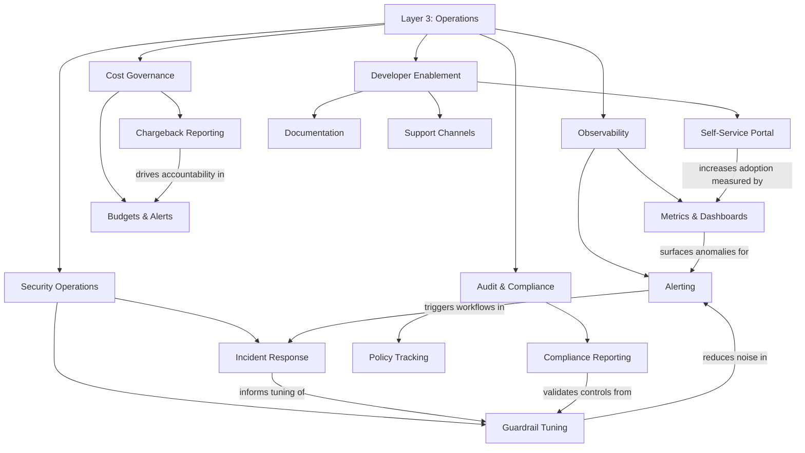

# Layer 3: Operations

A deployed gateway is not a mature platform. Maturity comes from the operational disciplines that surround the gateway and keep it healthy, accountable, and useful over time. This layer encompasses three categories of ongoing work -- observability, security operations, and developer enablement -- that reinforce each other in a flywheel. Better observability surfaces security issues faster. Stronger security operations build developer trust. Higher developer adoption generates richer telemetry. The flywheel accelerates with every turn.

---

## Why This Layer Matters

The most common failure in generative AI platform programs is not a bad deployment; it is the slow erosion of confidence after deployment. The gateway works on day one. By month three, no one knows who is spending what, alerts fire without context, developers route around the platform because it is easier to call providers directly, and security cannot answer basic questions about what data has been sent where. This is an operations failure, not a technology failure.

Operations matters because a platform is a living system. Models change. Provider pricing shifts. Regulations evolve. Teams onboard and offboard. Attack techniques improve. Without dedicated operational disciplines, the platform drifts from its governance mandate. Dashboards go stale, budgets go unenforced, and audit logs go unreviewed. The investment in governance and gateway infrastructure is wasted.

This layer also matters because it is where the platform earns or loses its internal reputation. Developers judge the platform by their experience: Can they see their usage? Can they debug a failed request? Can they get help without filing a ticket that disappears into a queue? Security judges the platform by their ability to detect and respond to incidents. Finance judges it by the accuracy and timeliness of cost reporting. Operations is the layer that serves all of these stakeholders simultaneously.

---

## Relationship to the Layer Below

Layer 3 consumes the telemetry, logs, and metadata produced by the Layer 2 gateway. Every metric on a dashboard, every line in a cost report, every alert in the security operations workflow, and every self-service portal displaying usage data originates from gateway instrumentation. The quality of operations is bounded by the quality of gateway telemetry. If the gateway does not emit structured, complete, and timely data, no amount of operational tooling can compensate. This dependency means that the operations team must have input into gateway instrumentation requirements; telemetry is not an afterthought but a first-class gateway design concern.

---

## Relationship to the Layer Above

Layer 4, Workloads, depends on operations for the feedback loops that make workloads successful. Evaluation requires logged interactions. Production monitoring requires observable metrics. Prompt engineering benefits from usage analytics. Teams building workloads need self-service access to their own data, documentation on platform capabilities, and a support channel when they encounter problems. Without mature operations, workload teams are building in the dark -- they ship features but cannot measure whether those features work, cost what was expected, or behave safely under adversarial conditions.

---

## Key Outcomes When This Layer Is Implemented Well

- **Real-time visibility.** Dashboards display request volume, latency, error rates, token consumption, and cost across every dimension (team, application, model, provider) with minimal delay.
- **Proactive alerting.** Anomalies in cost, latency, error rate, or content-filter trigger rate are detected and escalated before they become incidents.
- **Accurate cost attribution.** Every dollar of model-provider spending is attributed to a team, project, or application with enough granularity to support chargeback or showback models.
- **Continuous compliance.** Audit reports are generated from live data rather than manual evidence collection. Policy adherence is measured, not assumed.
- **Security responsiveness.** Guardrail bypass attempts, data-leakage patterns, and anomalous usage are detected, investigated, and resolved through a defined incident-response workflow.
- **Developer satisfaction.** Teams can onboard to the platform, find documentation, view their own usage, and get support without friction. Platform adoption grows organically rather than through mandates.
- **Governance feedback loop.** Operational data informs governance evolution. Policies that generate excessive false positives are refined. New risk patterns are fed back into the governance layer for policy updates.

---

## Internal Structure

**Observability** encompasses the metrics pipelines, dashboards, and alerting rules that provide real-time and historical visibility into platform health and usage. It covers request volume, latency percentiles, error rates, token throughput, and model-level performance.

**Cost Governance** operationalizes the financial controls defined in Layer 1. It tracks actual spending against budgets, generates chargeback or showback reports for consuming teams, and triggers alerts when spending trajectories indicate an impending overrun.

**Security Operations** is the ongoing practice of tuning content filters and guardrails based on observed traffic, investigating flagged interactions, responding to security incidents, and adapting defenses as attack techniques evolve. It is not a one-time configuration but a continuous discipline.

**Audit & Compliance** produces the evidence that regulators, internal auditors, and governance stakeholders require. It generates reports on policy adherence, access patterns, data handling, and incident history. It tracks the mapping between regulatory requirements and implemented controls, flagging gaps.

**Developer Enablement** is the set of resources and channels that make the platform usable and attractive to internal teams. It includes self-service portals for API key provisioning and usage visibility, documentation on platform capabilities and constraints, and support channels staffed by the platform team.

---

## Navigation

- [Principles](./principles.md) -- Operating principles that guide day-to-day platform management
- [Capabilities](./capabilities.md) -- Detailed breakdown of each operational capability
- [Best Practices](./best-practices.md) -- Patterns for building a sustainable operational practice
- [Anti-Patterns](./anti-patterns.md) -- Operational failures that erode platform trust
- [Decision Guide](./decision-guide.md) -- Prioritization frameworks for operational investment

---

*[Previous: Layer 2 -- Gateway](../02-gateway/README.md) | [Back to Framework Overview](../../../README.md) | [Next: Layer 4 -- Workloads](../04-workloads/README.md)*
