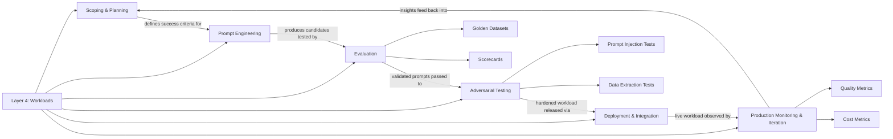

# Layer 4: Workloads

Workloads are the features and applications that teams build on the platform. This is where organizational value is created -- and where most failures occur. The biggest failure mode is not a bad prompt; it is building the wrong thing. A workload that solves a problem no one has, that cannot be evaluated objectively, or that reaches production without adversarial testing will fail regardless of how sophisticated the prompt engineering is. This layer defines the full workload lifecycle: scoping, prompt engineering, evaluation, adversarial testing, deployment, and production monitoring. Each phase has its own discipline, and skipping any of them compounds risk downstream.

---

## Why This Layer Matters

The layers below this one -- governance, gateway, and operations -- exist to serve workloads. They are infrastructure. Workloads are where the organization's investment in generative AI produces measurable outcomes: faster document processing, more accurate classification, better customer interactions, automated code review, intelligent search, and hundreds of other applications. If workloads fail, the entire platform investment is wasted.

Workloads matter at this layer of the framework (rather than being left entirely to individual teams) because generative AI workloads have characteristics that differ fundamentally from traditional software. Their outputs are non-deterministic. Their failure modes are subtle -- a model that returns confident, well-structured, and completely wrong answers looks like it is working. Their performance degrades silently when upstream models change. Their cost scales with usage in ways that are difficult to predict. And their attack surface includes the natural-language input itself, making adversarial testing essential rather than optional.

These characteristics mean that a structured lifecycle is not overhead; it is the difference between a workload that delivers value and one that delivers liability. Teams that skip scoping build features that do not align with business needs. Teams that skip evaluation cannot distinguish a good prompt from a lucky one. Teams that skip adversarial testing discover their vulnerabilities from external attackers rather than internal red teams. Teams that skip production monitoring learn about model drift from angry users rather than from dashboards.

---

## Relationship to the Layer Below

Workloads depend on Layer 3 operations for the feedback loops that drive quality. Evaluation requires access to logged interactions from the gateway. Production monitoring requires observable metrics from the operations layer. Prompt iteration benefits from usage analytics that reveal how real users interact with the workload. Cost tracking at the workload level depends on cost attribution from the operations layer. Developer enablement in operations provides the documentation, self-service tooling, and support channels that workload teams use daily. A workload team building without operational support is building without instrumentation -- they ship, but they cannot learn.

---

## Relationship to the Layer Above

Layer 5, Agent Security, becomes necessary when workloads evolve from stateless request-response interactions into autonomous agents that hold credentials, make multi-step decisions, and act across systems. The workload layer defines how agents are scoped, built, and evaluated. The agent security layer defines how they are registered, authorized, and governed at runtime. Workloads that are candidates for agent patterns must be designed with Layer 5 constraints in mind from the scoping phase. The boundary between a workload and an agent is not always crisp, and teams should evaluate whether their workload's autonomy level requires Layer 5 controls as part of the scoping process.

---

## Key Outcomes When This Layer Is Implemented Well

- **Value-aligned development.** Every workload begins with a scoping phase that validates the business problem, defines success criteria, and confirms that generative AI is the right approach before development starts.
- **Systematic prompt engineering.** Prompts are developed through structured experimentation with version control, documented rationale, and reproducible testing rather than ad-hoc trial and error.
- **Objective evaluation.** Golden datasets and evaluation scorecards provide quantitative measures of workload quality that are independent of developer intuition or anecdotal observation.
- **Adversarial resilience.** Workloads are tested against prompt injection, jailbreaking, data extraction, and other attack vectors before they reach production, with documented results and remediation plans.
- **Safe deployment.** Workloads move from development to production through a defined process that includes staged rollouts, rollback procedures, and production-readiness reviews.
- **Continuous improvement.** Production monitoring detects quality degradation, cost anomalies, and usage pattern changes, feeding insights back into prompt iteration and evaluation cycles.
- **Reduced waste.** Structured scoping eliminates workloads that would have failed regardless of implementation quality, focusing engineering effort on high-value opportunities.

---

## Internal Structure

**Scoping & Planning** is the discipline of defining what a workload should accomplish, who it serves, what success looks like quantitatively, and whether generative AI is the appropriate technology. It produces a workload brief that guides all subsequent phases.

**Prompt Engineering** is the systematic development of prompts through structured experimentation. It includes prompt versioning, few-shot example curation, system-message design, chain-of-thought structuring, and documentation of design decisions and trade-offs.

**Evaluation** measures workload quality objectively. Golden datasets provide known-good input-output pairs against which prompt candidates are scored. Scorecards define the dimensions of quality (accuracy, relevance, safety, latency, cost) and their relative weights for each workload.

**Adversarial Testing** subjects the workload to deliberate attacks: prompt injection, jailbreaking, indirect prompt injection through retrieved content, data extraction attempts, and denial-of-service through token-expensive inputs. Results are documented and defenses are hardened before deployment.

**Deployment & Integration** covers the mechanics of moving a workload from development to production: integration with consuming applications, staged rollout strategies, feature flags, rollback procedures, and production-readiness checklists.

**Production Monitoring & Iteration** is the ongoing observation of a live workload's quality, cost, latency, and usage patterns. It detects regressions caused by model updates, data drift, or changing user behavior, and feeds insights back into the scoping and prompt engineering phases for continuous improvement.

---

## Navigation

- [Principles](./principles.md) -- Design principles for building reliable generative AI workloads
- [Capabilities](./capabilities.md) -- Detailed breakdown of each lifecycle phase
- [Best Practices](./best-practices.md) -- Patterns from teams that ship workloads successfully
- [Anti-Patterns](./anti-patterns.md) -- Common mistakes that lead to workload failure
- [Decision Guide](./decision-guide.md) -- Criteria for scoping decisions, model selection, and deployment strategies

---

*[Previous: Layer 3 -- Operations](../03-operations/README.md) | [Back to Framework Overview](../../../README.md) | [Next: Layer 5 -- Agent Security](../05-agent-security/README.md)*
