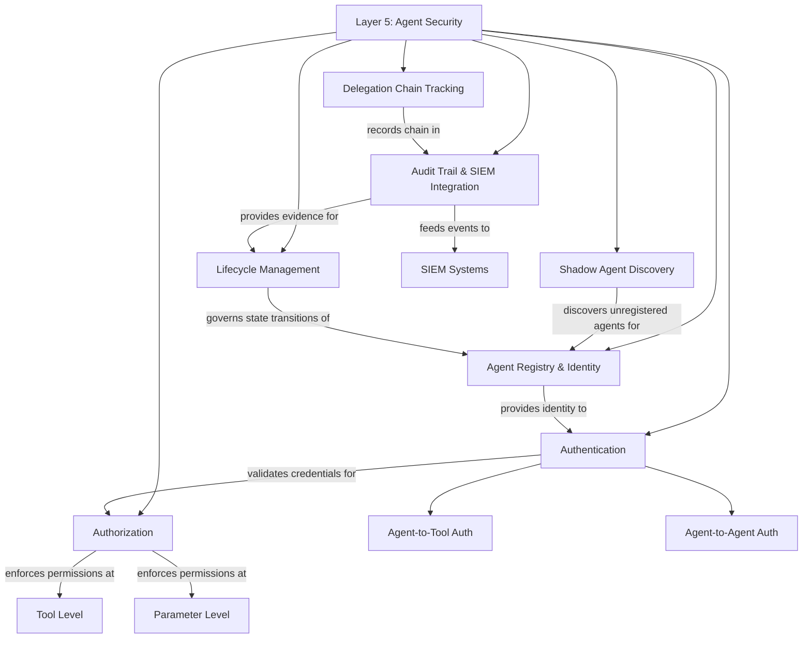

# Layer 5: Agent Security

When workloads evolve beyond stateless request-response patterns into autonomous agents that hold credentials, make multi-step decisions, invoke tools, and act across systems on behalf of users, a new category of risk emerges that the lower layers were not designed to address. An agent is not just a prompt with a loop; it is a software actor with delegated authority, and it requires the same identity, authentication, authorization, and audit controls that any privileged actor in an enterprise environment requires. This layer defines the controls that make autonomous agents governable, auditable, and safe to operate at scale.

---

## Why This Layer Matters

The progression from simple model calls to autonomous agents is already underway in most organizations experimenting with generative AI. A summarization prompt becomes a research agent that queries multiple data sources. A code-review assistant becomes a coding agent that opens pull requests. A customer-support draft generator becomes an agent that reads tickets, queries knowledge bases, and posts responses. Each step in this progression increases the agent's autonomy, its access to sensitive systems, and the blast radius when it behaves unexpectedly.

Agent security matters because the existing layers, while necessary, are insufficient for this class of workload. The gateway authenticates the caller and enforces content policies on individual requests, but it does not track that those requests are part of a multi-step chain initiated by a delegation from a human user. Operations monitors aggregate metrics, but it does not trace a single agent's decision path across multiple tool invocations. Governance defines acceptable use, but it does not address questions like: Can this agent delegate to another agent? What tools can it invoke? What parameter values are it permitted to pass?

Without this layer, organizations face three specific dangers. First, privilege escalation: an agent accumulates permissions across the tools it can invoke that no single human would be granted. Second, accountability gaps: when an agent takes an action that causes harm, no one can reconstruct the decision chain that led to it. Third, shadow agents: teams deploy autonomous loops that are not registered, not monitored, and not subject to any of the controls the platform provides.

---

## Relationship to the Layer Below

Layer 5 builds on Layer 4's workload lifecycle. Agents are workloads -- they go through scoping, prompt engineering, evaluation, adversarial testing, deployment, and monitoring. But agents require additional controls at each phase. Scoping must define the agent's authority boundaries. Evaluation must test multi-step reasoning chains, not just single-turn outputs. Adversarial testing must include tool-abuse scenarios and delegation-chain attacks. Deployment must include registration in the agent registry. Monitoring must trace the full execution path, not just individual model calls. Layer 5 does not replace the workload lifecycle; it extends it with agent-specific requirements.

---

## Relationship to the Layer Above

There is no layer above agent security in this framework. This is the current frontier. As the field evolves, additional layers may emerge to address multi-organization agent federations, cross-enterprise delegation, or other patterns that extend beyond a single organization's boundary. For now, agent security is the capstone: the layer that makes the most autonomous and most powerful applications of generative AI safe enough to operate in production.

---

## Key Outcomes When This Layer Is Implemented Well

- **Agent identity.** Every autonomous agent has a registered identity with a defined owner, purpose, authority scope, and lifecycle state. No anonymous agents operate in the environment.
- **Least-privilege tool access.** Agents are authorized at the tool level and the parameter level, ensuring they can only invoke the specific capabilities required for their defined purpose.
- **Delegation traceability.** Every action an agent takes can be traced back through the delegation chain to the human or system event that initiated it. The chain is never broken, even across agent-to-agent handoffs.
- **Comprehensive audit trail.** Every tool invocation, every decision branch, every input and output in an agent's execution is logged in a format that integrates with the organization's security information and event management infrastructure.
- **Shadow agent detection.** Autonomous loops that bypass the platform's agent registry are discovered through network monitoring, API-usage analysis, or anomaly detection and are brought under management or terminated.
- **Controlled lifecycle.** Agents move through defined states (development, staging, production, suspended, decommissioned) with appropriate reviews and approvals at each transition.
- **Bounded blast radius.** When an agent misbehaves, its authority scope limits the damage, its audit trail enables rapid diagnosis, and its lifecycle controls enable immediate suspension.

---

## Internal Structure

**Agent Registry & Identity** is the authoritative inventory of all autonomous agents operating in the environment. Each entry records the agent's unique identity, owning team, declared purpose, authority scope, approved tool set, and current lifecycle state. Registration is a prerequisite for production deployment.

**Authentication** encompasses two distinct authentication domains. Agent-to-tool authentication verifies the agent's identity when it invokes an external tool or API. Agent-to-agent authentication verifies identity when one agent delegates to or communicates with another. Both domains use machine-identity credentials that are rotated, scoped, and revocable.

**Authorization** enforces least-privilege access at two granularity levels. Tool-level authorization determines which tools an agent may invoke. Parameter-level authorization constrains the values an agent may pass to those tools -- for example, permitting an agent to query a database but only for records in a specific scope, or permitting an agent to send messages but only to specific channels.

**Delegation Chain Tracking** maintains an unbroken record of the chain of authority from the originating human action or system event through every agent handoff and tool invocation. When agent A delegates a subtask to agent B, the delegation chain records the delegating agent, the receiving agent, the scope of delegated authority, and the timestamp. This chain is the foundation for accountability.

**Audit Trail & SIEM Integration** captures every significant event in an agent's execution -- tool invocations, decision branches, errors, retries, delegation events -- in a structured log format that integrates with the organization's security information and event management infrastructure. This enables security operations to correlate agent activity with other enterprise security events.

**Shadow Agent Discovery** addresses the reality that not all autonomous loops will be registered voluntarily. This capability uses network traffic analysis, API-usage pattern detection, and behavioral anomaly detection to identify agent-like activity that is not associated with a registered agent identity. Discovered shadow agents are flagged for registration or termination.

**Lifecycle Management** governs the transitions an agent makes through its operational states: development, staging, production, suspended, and decommissioned. Each transition has defined criteria and approvals. Production deployment requires completed evaluation and adversarial testing from Layer 4, a registered identity, approved tool authorizations, and a designated human owner. Suspension can be triggered manually or automatically in response to security events.

---

## Navigation

- [Principles](./principles.md) -- Security principles for autonomous agent governance
- [Capabilities](./capabilities.md) -- Detailed specification of each agent security capability
- [Best Practices](./best-practices.md) -- Patterns for safe agent deployment at scale
- [Anti-Patterns](./anti-patterns.md) -- Dangerous shortcuts in agent security
- [Decision Guide](./decision-guide.md) -- When to apply agent security controls and at what granularity

---

*[Previous: Layer 4 -- Workloads](../04-workloads/README.md) | [Back to Framework Overview](../../../README.md)*
