# Maturity Model

## Why a Maturity Model Matters

Organizations adopting generative AI face a common trap: they either move too fast, deploying workloads without governance or observability, or too slow, building elaborate frameworks before a single model call is made. Both paths lead to failure. Moving too fast creates shadow deployments, compliance violations, and runaway costs. Moving too slow breeds frustration, drives teams to unsanctioned workarounds, and squanders competitive advantage.

A maturity model solves this by providing a sequenced roadmap. It tells you what to build first, what to defer, and how to know when you are ready to advance. It prevents over-engineering at early stages while ensuring that the foundational layers, governance and gateway, are solid before operational complexity is layered on top. It ensures that agent security, the most advanced concern, is not attempted before the underlying infrastructure can support it.

The maturity model described here is prescriptive. It is not a menu of options. Each stage has entry criteria, capabilities to build, and exit criteria that signal readiness for the next stage. Organizations that skip stages accumulate technical and organizational debt that becomes increasingly expensive to remediate.

## The Three Stages

The model defines three stages of maturity. Each stage builds on the previous one. Regression is possible and should be monitored.

### Stage 1: Foundation

The organization establishes the governance and gateway layers that all future capabilities depend on. Policies are drafted, data classification is defined, and a centralized gateway begins routing all sanctioned model traffic. Operations exist only in minimal form: basic logging and cost tracking. Workloads and agent security are not yet active.

**Primary layers:** Governance, Gateway
**Minimal layers:** Operations
**Inactive layers:** Workloads, Agent Security

### Stage 2: Operational

The organization matures its operations layer into a full observability and developer-experience stack. Workloads are formally onboarded with evaluation pipelines and adversarial testing. Agent security begins with basic registration and identity models. Governance shifts from drafting to enforcement and review.

**Primary layers:** Governance, Gateway, Operations, Workloads
**Emerging layers:** Agent Security

### Stage 3: Optimized

All five layers are fully active and continuously improving. Governance becomes data-driven with automated compliance reporting. The gateway performs sophisticated routing optimized across cost, latency, and capability. Operations proactively forecast costs and tune guardrails automatically. Workloads run automated adversarial testing in continuous integration. Agent security enforces delegation chains, tool-level authorization, and mutual authentication.

**Primary layers:** All five layers fully active

## How Stages Relate to the Five Layers

Not every layer is active at every stage. This is intentional. Attempting to implement agent security before a gateway exists, or onboarding workloads before governance policies are defined, creates fragile systems built on incomplete foundations.

The following diagram illustrates which layers are primary, minimal, or inactive at each stage.

```mermaid
graph LR
    subgraph Stage1["Stage 1: Foundation"]
        S1L1["Layer 1: Governance<br/><strong>PRIMARY</strong>"]
        S1L2["Layer 2: Gateway<br/><strong>PRIMARY</strong>"]
        S1L3["Layer 3: Operations<br/><em>Minimal</em>"]
        S1L4["Layer 4: Workloads<br/>Inactive"]
        S1L5["Layer 5: Agent Security<br/>Inactive"]
    end

    subgraph Stage2["Stage 2: Operational"]
        S2L1["Layer 1: Governance<br/><strong>PRIMARY</strong>"]
        S2L2["Layer 2: Gateway<br/><strong>PRIMARY</strong>"]
        S2L3["Layer 3: Operations<br/><strong>PRIMARY</strong>"]
        S2L4["Layer 4: Workloads<br/><strong>PRIMARY</strong>"]
        S2L5["Layer 5: Agent Security<br/><em>Emerging</em>"]
    end

    subgraph Stage3["Stage 3: Optimized"]
        S3L1["Layer 1: Governance<br/><strong>PRIMARY</strong>"]
        S3L2["Layer 2: Gateway<br/><strong>PRIMARY</strong>"]
        S3L3["Layer 3: Operations<br/><strong>PRIMARY</strong>"]
        S3L4["Layer 4: Workloads<br/><strong>PRIMARY</strong>"]
        S3L5["Layer 5: Agent Security<br/><strong>PRIMARY</strong>"]
    end

    Stage1 --> Stage2 --> Stage3
```

## How to Use This Maturity Model

### 1. Assess Your Current State

Begin with the [Maturity Assessment](assessment.md). This self-assessment questionnaire covers all five layers with specific, measurable questions. Each question is scored on a 0-3 scale. The aggregate score places your organization into one of the three stages and identifies specific gaps.

### 2. Identify Gaps

Low scores in foundational layers (Governance, Gateway) are blockers. They must be addressed before investing in higher layers. Low scores in operational layers indicate risk: workloads may be running without adequate observability or evaluation. The assessment provides gap identification guidance to help prioritize remediation.

### 3. Plan Progression

Use the stage documents to understand exactly what capabilities must be built to advance. Each stage document defines entry criteria, capabilities to build, and exit criteria per layer. This provides a concrete project plan, not an abstract aspiration.

### 4. Reassess Quarterly

Maturity is not permanent. Team changes, new model providers, evolving regulations, and workload growth can all cause regression. Reassess quarterly to detect drift and adjust plans.

## Stage Documents

Each stage is documented in detail with entry criteria, capabilities, and exit criteria for every layer:

- **[Stage 1: Foundation](stage-1-foundation.md)** -- Establish governance and deploy the gateway. Build the base that everything else depends on.
- **[Stage 2: Operational](stage-2-operational.md)** -- Mature operations, onboard workloads formally, and begin agent security. Move from foundational to production-grade.
- **[Stage 3: Optimized](stage-3-optimized.md)** -- All layers fully active and continuously improving. Automation replaces manual processes. Proactive replaces reactive.

## Assessment

- **[Maturity Assessment](assessment.md)** -- Self-assessment questionnaire with scoring methodology and gap identification guidance. Start here if you are unsure of your current stage.

## Key Principles

**Sequence matters.** Governance before gateway. Gateway before operations. Operations before workloads. Workloads before agent security. Each layer depends on the ones below it.

**Exit criteria are not optional.** Advancing to the next stage before exit criteria are met creates debt. The exit criteria exist because downstream capabilities depend on them.

**Maturity is per-layer, not per-organization.** An organization may be at Stage 2 for governance but Stage 1 for operations. The overall maturity stage is determined by the lowest-scoring foundational layer, because a chain is only as strong as its weakest link.

**Continuous improvement is the final stage, not a destination.** Stage 3 is not a finish line. It is a mode of operation where measurement, feedback, and automated refinement are ongoing.
