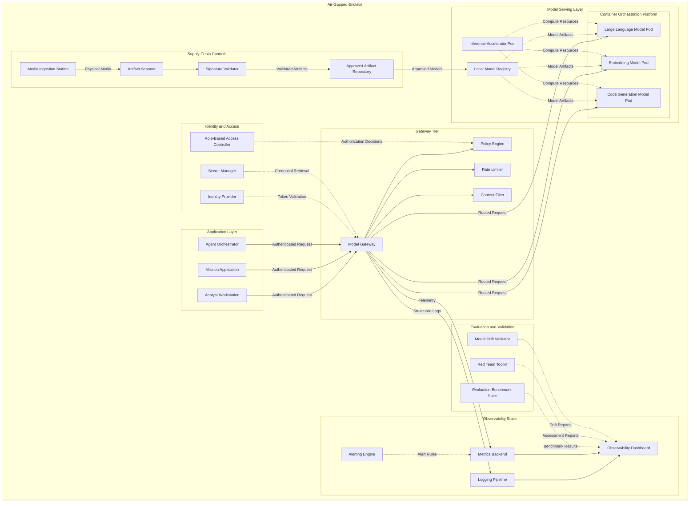

# Air-Gapped Architecture

## Overview

The air-gapped architecture deploys every component required for generative AI inference within a fully disconnected network enclave. There is no connectivity to the public internet, no access to external model APIs, and no telemetry leaving the perimeter. Every artifact, from model weights to runtime dependencies to evaluation datasets, must be physically transferred into the environment through controlled media ingestion processes.

This architecture serves classified government environments, defense programs, intelligence agencies, and private-sector organizations with extreme security requirements such as financial trading floor enclaves or research environments handling embargoed data. The defining constraint is absolute network isolation: the environment must function with zero external dependencies at runtime.

The air-gapped pattern is the most operationally demanding of the four reference architectures. It exchanges the convenience of cloud-managed services for complete control over every component in the stack. Organizations adopting this pattern must build internal capabilities for model hosting, evaluation, patching, and lifecycle management that are otherwise outsourced to cloud providers.

## Architecture Diagram

## Self-Hosted Model Deployment

Every model runs on infrastructure owned and operated within the enclave. There are no managed inference APIs to call. The organization must provision inference accelerator hardware, deploy a container orchestration platform, and operate a model serving framework that loads model weights from a local model registry and exposes inference endpoints on the internal network.

**Hardware planning.** Model serving requires specialized accelerator hardware for acceptable throughput and latency. Capacity planning must account for peak concurrent users, the number of distinct models served simultaneously, and the memory footprint of each model. Unlike cloud environments where capacity can be elastically scaled, air-gapped hardware is fixed once deployed. Over-provisioning is the standard approach because procurement cycles for classified environments can span months.

**Model registry.** The local model registry stores versioned model artifacts, including weights, tokenizer configurations, and serving metadata. It functions as the single source of truth for which models are approved for deployment. Only artifacts that have passed through the supply chain controls pipeline are admitted to the registry.

**Container orchestration.** Models are packaged as container images and orchestrated by a container orchestration platform that handles scheduling, health checking, scaling within the available hardware pool, and rolling updates when new model versions are approved. The orchestration platform itself runs entirely within the enclave with no external control plane dependency.

## Local Gateway

The model gateway in an air-gapped environment provides the same functions as in connected architectures: unified API surface, policy enforcement, rate limiting, content filtering, and observability. The difference is that every supporting service the gateway depends on must also be self-hosted.

The identity provider, secret manager, policy engine, and logging pipeline all run as internal services within the enclave. There are no external authentication endpoints to federate with, no cloud-hosted secret stores to call, and no external log aggregation services to ship to. Each of these services must be deployed, configured, backed up, and maintained by the enclave's operations team.

The gateway's content filter deserves special attention in air-gapped environments. Connected gateways can call external content moderation APIs or retrieve updated filter rule sets over the network. The air-gapped gateway's content filter must rely on locally maintained rule sets and locally hosted classification models. Updates to these rules follow the same supply chain ingestion process as model weights.

## Offline Evaluation

Model quality assurance in connected environments often relies on external evaluation services, leaderboard comparisons, or real-time A/B testing against cloud-hosted alternatives. None of these are available in an air-gapped environment.

The evaluation benchmark suite is an internal tool that runs a standardized set of tests against each model before it is promoted to production serving. Benchmarks should cover accuracy on domain-relevant tasks, latency under load, output safety, and consistency across repeated runs. Benchmark results are stored in the observability stack alongside operational metrics, providing a longitudinal view of model quality over time.

The red team toolkit enables security and safety assessments of deployed models. Red team exercises probe for prompt injection vulnerabilities, information leakage, harmful output generation, and other failure modes. Because the enclave handles sensitive data, red team findings may themselves be sensitive and must be stored with appropriate access controls.

The model drift validator compares the behavior of a newly ingested model version against the currently deployed version using a fixed evaluation dataset. If the new version's behavior drifts beyond acceptable thresholds, the validator flags it for human review before promotion. This prevents the accidental deployment of a model version that has regressed on critical tasks.

## Supply Chain Controls

The supply chain is the most distinctive aspect of the air-gapped architecture. Every artifact that enters the enclave, whether model weights, container images, software packages, configuration files, or evaluation datasets, crosses the air gap through a controlled physical media ingestion process.

**Media ingestion station.** Removable media containing artifacts is received at a dedicated ingestion station that sits at the boundary of the enclave. This station is not connected to the enclave's operational network. It is a standalone system whose sole purpose is to receive, scan, and validate incoming media.

**Artifact scanning.** The artifact scanner examines every file on the ingested media for malware, known vulnerabilities, and policy violations. Container images are decompressed and their layers scanned individually. Model weight files are validated for expected file formats and sizes. Software packages are checked against a vulnerability database that is itself updated through the same ingestion process.

**Signature validation.** Every artifact must carry a cryptographic signature from an authorized source. The signature validator checks these signatures against a locally maintained trust store. Unsigned artifacts or artifacts signed by unrecognized keys are rejected. This ensures that only artifacts originating from the organization's approved build pipelines enter the enclave.

**Approved artifact repository.** Artifacts that pass scanning and signature validation are promoted to the approved artifact repository, which serves as the enclave's internal package registry, container registry, and model store. All deployment pipelines pull exclusively from this repository.

## Design Decisions

### Why containerize models in an air-gapped environment?

Reproducibility and rollback. Container images capture the full runtime environment, including model weights, serving framework, and system dependencies, in an immutable artifact. If a new model version causes problems, operators can roll back to a previous container image with confidence that the entire serving environment reverts, not just the weights.

### Why a dedicated media ingestion station rather than a direct transfer port?

Isolation. The ingestion station is not connected to the operational network. If ingested media contains malicious payloads, the blast radius is limited to the ingestion station itself. The operational network is never exposed to unscanned artifacts.

### Why maintain an internal evaluation suite rather than relying on pre-deployment testing outside the enclave?

Environmental fidelity. Models may behave differently depending on the serving framework version, the accelerator hardware, the precision format, and the operating system. Testing within the enclave validates behavior in the actual production environment. Pre-deployment testing outside the enclave cannot account for these environment-specific factors.

### Why local identity rather than federated identity?

No external dependency. Federated identity requires network connectivity to an external identity provider. In an air-gapped environment, the identity provider must run locally. This means the enclave maintains its own user directory, its own authentication service, and its own token issuance infrastructure.

### Why store red team findings with restricted access?

Red team reports describe model vulnerabilities and exploitation techniques. In a classified environment, these findings are sensitive in their own right because they document how a cleared analyst might extract information or bypass safety controls. Access to red team findings must be limited to authorized security personnel.

## Limitations

- **Model freshness.** New model versions arrive only when someone physically ingests media into the enclave. There is an inherent delay between a model's public availability and its deployment inside the air gap. For rapidly evolving model families, the enclave will always run versions that are weeks or months behind.
- **Hardware rigidity.** Inference accelerator hardware cannot be elastically scaled. Peak workloads that exceed the installed capacity result in queuing or request rejection. Capacity expansions require hardware procurement, security accreditation, and physical installation cycles.
- **Operational burden.** Every service that a connected architecture delegates to a cloud provider must be self-hosted, patched, and operated by the enclave team. This includes the container orchestration platform, the identity provider, the secret manager, the logging pipeline, the metrics backend, and the evaluation tooling. The staffing and expertise requirements are substantial.
- **Update latency for safety controls.** Content filter rules and vulnerability databases can only be updated through the media ingestion process. If a new prompt injection technique is discovered, the time to deploy a countermeasure is bounded by the ingestion cycle, not by a network-delivered update.
- **Limited model diversity.** The hardware footprint of the enclave constrains how many distinct models can be served simultaneously. Organizations must make deliberate choices about which models to host, balancing breadth of capability against the cost and complexity of serving additional models.
