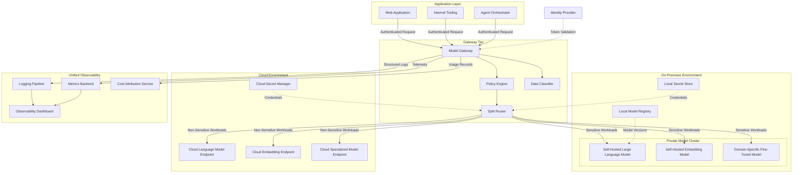

# Hybrid Architecture

## Overview

The hybrid architecture connects on-premises model infrastructure with cloud-hosted model endpoints through a gateway that makes routing decisions based on data sensitivity, latency requirements, and cost targets. It exists because many organizations face a fundamental tension: some data must not leave the corporate perimeter, yet the breadth and scale of cloud-hosted models are too valuable to forfeit entirely.

This pattern is most common in regulated industries, where data residency mandates, intellectual property concerns, or contractual obligations require that certain workloads run on infrastructure the organization physically controls. At the same time, those organizations need access to large frontier models, embedding services, or specialized fine-tuned models that are impractical to host on-premises due to hardware cost or operational complexity.

The gateway resolves this tension by acting as a classification-aware router. It inspects each request, evaluates it against data handling policies, and directs it to the appropriate tier: the on-premises model cluster for sensitive workloads or cloud model endpoints for everything else. Applications do not need to know which tier served their request. The routing decision is a policy concern, not an application concern.

## Architecture Diagram

## Split Routing

The split router is the distinguishing component of the hybrid architecture. It receives each request after the policy engine and data classifier have annotated it, then directs it to the appropriate tier.

**Classification-based routing.** The data classifier examines request payloads and assigns a sensitivity label. Requests carrying data above a defined sensitivity threshold are routed to on-premises models. Requests below that threshold are eligible for cloud routing. The classification can be automatic, based on pattern matching or a lightweight classification model, or it can rely on labels that the calling application attaches to the request.

**Model-availability routing.** Not every model is available in both tiers. The on-premises cluster typically hosts a smaller set of models due to hardware constraints. If a request targets a model that exists only in the cloud and the data classification permits cloud routing, the router sends it to the cloud. If the request targets a cloud-only model but the data classification forbids cloud routing, the router rejects the request with a clear error rather than silently downgrading to a less capable on-premises model.

**Latency-preference routing.** Some workloads are latency-sensitive and benefit from on-premises routing, which avoids the round-trip to a cloud endpoint. The router can factor latency preferences expressed by the calling application into its decision, provided the data classification policy is not violated.

**Cost-aware routing.** On-premises inference has a different cost profile than cloud inference: high fixed cost for hardware and low marginal cost per request. The router can prefer on-premises capacity when utilization is below a threshold, shifting overflow to cloud endpoints. This maximizes the return on the on-premises hardware investment while using cloud elasticity for burst traffic.

## Data Residency Enforcement

Data residency is the primary driver for hybrid architectures, and enforcement must be rigorous. The data classifier and policy engine together ensure that no request carrying restricted data leaves the corporate perimeter.

Enforcement operates at multiple layers. At the gateway layer, the data classifier inspects payloads and applies routing restrictions. At the network layer, the on-premises model cluster has no outbound connectivity to the internet; it communicates only with the gateway and local supporting services. At the credential layer, on-premises models use credentials from a local secret store, not from the cloud secret manager, ensuring that an on-premises model process cannot accidentally reach a cloud endpoint even if application logic is misconfigured.

The logging pipeline must also respect residency. Logs containing sensitive request or response content from on-premises workloads should be stored in the on-premises observability stack. Only sanitized metadata, such as latency, token counts, and model identifiers, should flow to the unified dashboard if that dashboard resides in the cloud.

## Private Connectivity

The network path between the gateway and cloud model endpoints must be secured. Direct internet routing is discouraged. Instead, organizations should use private connectivity services that establish dedicated, non-internet network paths between the corporate network and the cloud provider's network. These connections provide consistent bandwidth, lower latency, and a smaller attack surface compared to internet-routed traffic.

Where private connectivity is not available, encrypted tunnels over the internet are the fallback. All traffic between the gateway and cloud endpoints must be encrypted in transit using current transport layer security standards, and the gateway should validate the endpoint's certificate chain to prevent interception.

The gateway itself may be deployed on-premises, in the cloud, or in both locations with a load-balancing layer in front. Deploying the gateway on-premises ensures that all traffic, including requests destined for the cloud, originates from within the corporate perimeter. This simplifies network security reviews because the gateway is the sole egress point for model traffic.

## Unified Observability

Operating two distinct model tiers creates a fragmented operational picture unless observability is deliberately unified. The hybrid architecture addresses this through a logging pipeline and metrics backend that accept telemetry from both tiers and normalize it into a consistent schema.

Every request, whether routed on-premises or to the cloud, produces a log record with the same fields: request identifier, caller identity, model identifier, routing decision, token counts, latency, and cost estimate. The observability dashboard consumes these records and presents a single view of model usage, performance, and cost across both tiers.

Alerting rules should span both tiers. An on-premises model that begins returning elevated error rates should trigger the same alerting workflow as a cloud endpoint experiencing degraded performance. Operators should not need to switch between two monitoring systems to understand the health of the overall model serving layer.

## Design Decisions

### Why classify at the gateway rather than at the application?

Application-layer classification is unreliable at scale. Each team would need to implement the same classification logic, keep it updated as policies change, and test it against the same edge cases. A single classification point at the gateway ensures that policy updates propagate immediately and that no application can bypass classification, whether through negligence or misconfiguration.

### Why reject requests rather than silently downgrade models?

Silent model substitution introduces unpredictable quality degradation. If an application requests a cloud-only model but the data requires on-premises routing, silently substituting a smaller on-premises model may produce outputs that are subtly wrong, leading to user confusion or downstream errors. An explicit rejection with a clear error message forces the application team to make a deliberate decision about how to handle the constraint.

### Why deploy on-premises models behind the same gateway interface?

Consistency for application teams. If on-premises and cloud models expose different APIs, application teams must maintain two integration paths, two error-handling strategies, and two sets of client libraries. The gateway presents a single API contract regardless of which tier serves the request, eliminating this duplication.

### Why isolate on-premises model networking from the internet?

Defense in depth. Even if the gateway is compromised, the on-premises model cluster remains unreachable from outside the corporate network. The models, their weights, and the sensitive data they process are protected by network-level isolation that is independent of application-layer security controls.

### Why normalize cost across tiers?

On-premises and cloud inference have fundamentally different cost structures. Without normalization, cost reports are misleading: on-premises requests appear cheap because marginal cost is low, while the fixed hardware investment is amortized elsewhere in the budget. The cost attribution service applies a blended rate that reflects the true cost of on-premises inference, enabling accurate comparison and informed routing decisions.

## Limitations

- **Operational complexity.** Two model tiers mean two sets of infrastructure to provision, patch, and scale. On-premises model serving requires specialized hardware procurement, driver management, and capacity planning that cloud-native teams may lack experience with.
- **Model parity gaps.** The on-premises model catalog will always lag behind the cloud catalog. New model releases are available in the cloud first and may never be practical to self-host due to hardware requirements.
- **Classification accuracy.** The data classifier is a critical dependency. False negatives, where sensitive data is classified as non-sensitive and routed to the cloud, represent a compliance failure. The classifier requires ongoing tuning, testing, and auditing.
- **Private connectivity cost.** Dedicated network connections between the corporate network and cloud providers carry significant fixed costs that must be justified by the volume of traffic they carry.
