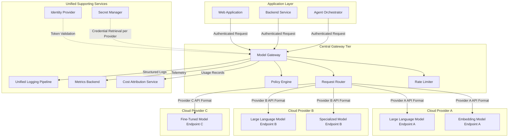

# Multi-Cloud Architecture

## Overview

The multi-cloud architecture places a centralized model gateway in front of model endpoints hosted across multiple cloud providers. The gateway serves as the abstraction layer that shields application workloads from provider-specific API differences, credential formats, and endpoint behaviors. Applications submit inference requests to the gateway using a uniform interface; the gateway translates, routes, and delivers those requests to the appropriate provider endpoint.

Organizations adopt this pattern for several reasons. Some need access to specialized models that are exclusive to different providers. Others require cross-provider failover to meet availability targets that no single provider can guarantee alone. Still others use multi-cloud routing as a cost optimization lever, directing traffic to whichever provider offers the most favorable pricing for a given model class at a given time. The common thread is that the gateway insulates application teams from the complexity of managing multiple provider relationships directly.

The trade-off is operational overhead. Multi-cloud introduces credential sprawl, divergent API contracts, inconsistent error semantics, and network paths that cross provider boundaries. The gateway absorbs this complexity, but the gateway itself becomes a more sophisticated component that requires careful engineering and operational attention.

## Architecture Diagram

## Routing Strategies

The request router within the gateway determines which provider endpoint receives each inference request. Several routing strategies can coexist within the same gateway deployment:

**Model-affinity routing.** Some models are only available through a specific provider. The router maintains a model catalog that maps logical model identifiers (used by applications) to physical provider endpoints. When an application requests a model that exists on only one provider, routing is deterministic.

**Cost-optimized routing.** For models that are available from multiple providers at different price points, the router can select the lowest-cost endpoint that meets the request's latency and quality requirements. This requires the router to maintain a pricing table and to factor in token-based pricing differences, including distinct rates for input and output tokens.

**Failover routing.** The router monitors endpoint health through periodic probes or by analyzing error rates from recent requests. When a primary endpoint becomes unhealthy, the router redirects traffic to a secondary endpoint on a different provider. Failover targets must be pre-validated to ensure that the alternative model produces acceptable output quality for the workloads being rerouted.

**Latency-based routing.** For latency-sensitive workloads, the router can prefer the provider whose endpoint is geographically closest to the gateway deployment or whose recent response times are lowest. This strategy is most effective when the gateway is deployed in a region with low-latency connectivity to multiple providers.

**Canary routing.** When evaluating a new model or a new provider endpoint, the router can direct a configurable percentage of traffic to the candidate while the remainder continues to flow to the established endpoint. This enables data-driven comparison of quality, latency, and cost before committing to a full cutover.

## Credential Management

Each cloud provider requires its own credential set. The gateway retrieves provider-specific credentials from a centralized secret manager at request time. Credentials are never embedded in gateway configuration files, environment variables, or application code.

Credential rotation schedules should be independent per provider. The secret manager handles rotation, and the gateway fetches the current credential on each request or caches it with a short time-to-live that ensures rotated credentials take effect promptly.

Scoping is critical. Each provider credential should carry the minimum permissions required: invoke inference endpoints and nothing more. The credential should not grant access to the provider's compute, storage, networking, or identity management APIs. This limits the blast radius if a credential is exfiltrated from the secret manager or intercepted in transit.

For providers that support workload identity federation, where the gateway can present a token from the organization's own identity provider and exchange it for a short-lived provider credential, this approach is preferred over long-lived API keys. Federation eliminates the need to store provider credentials in the secret manager entirely.

## Consistent Policy Enforcement

A central motivation for the gateway architecture is that policy enforcement happens once, uniformly, regardless of which provider ultimately serves the request. The policy engine evaluates every request before routing and every response before delivery to the caller.

**Content policies.** Input and output filtering rules are defined once and applied to all traffic. This ensures that a content policy violation cannot be circumvented by routing a request to a provider whose native content filters are more permissive.

**Data classification enforcement.** The policy engine inspects request payloads and applies data classification rules. Requests containing data tagged above a certain sensitivity level can be restricted to a subset of providers that meet the corresponding data handling requirements, such as providers with endpoints in specific geographic regions or providers that have completed specific compliance certifications.

**Token budgets and rate limits.** Per-team and per-application quotas are enforced at the gateway, not at individual provider endpoints. This prevents a single consumer from exhausting quotas across multiple providers simultaneously and ensures that budget controls reflect the organization's allocation decisions rather than each provider's default rate limits.

**Audit logging.** Every request and response is logged to a unified logging pipeline with a consistent schema, regardless of provider. This means compliance teams can query a single log store to answer questions about what data was sent to which model, when, and by whom, without needing to reconcile log formats from three different provider consoles.

## Design Decisions

### Why centralize the gateway rather than deploy per-provider gateways?

A per-provider gateway model pushes routing and failover logic into the application layer, which defeats the purpose of abstracting provider complexity. A centralized gateway maintains a single routing table, a single policy engine, and a single credential retrieval path. Applications interact with one endpoint and one API contract. The cost is that the centralized gateway becomes a critical dependency and must be engineered for high availability, but this is a more tractable problem than distributing provider-aware logic across every application.

### Why normalize the API contract at the gateway?

Provider APIs differ in parameter names, response envelope structures, streaming protocols, error code semantics, and token counting methods. If applications consume these APIs directly, every application must implement provider-specific adapters. The gateway normalizes inbound requests to a canonical format, translates them to provider-specific formats on the outbound path, and normalizes responses back before returning them. Application teams write to one API contract and are insulated from provider API changes.

### Why unified logging rather than per-provider log aggregation?

Per-provider log aggregation requires reconciling different schemas, timestamp formats, and field semantics after the fact. Unified logging at the gateway captures every request and response in a single schema before provider-specific formatting is applied. This produces a clean, queryable audit trail without post-hoc normalization.

### Why enforce data classification at the gateway?

Data classification enforcement at the application layer is inconsistent because each team implements it differently, if at all. Enforcement at the provider layer is impossible because providers do not understand the organization's classification taxonomy. The gateway is the only point in the architecture where organizational classification policy and provider routing decisions intersect, making it the natural enforcement point.

### Why prefer workload identity federation over stored API keys?

Stored API keys are long-lived secrets that can be exfiltrated, shared, or forgotten. Workload identity federation produces short-lived, automatically rotated credentials that are scoped to the gateway's identity. There is no secret to steal because the credential does not exist until the moment it is needed and expires shortly after use.

## Limitations

- **Gateway complexity.** The gateway must understand the API contracts of every provider it routes to. Provider API changes require gateway updates. This is a maintenance burden that scales with the number of providers.
- **Cross-provider latency.** Requests that cross cloud provider boundaries incur additional network latency. For latency-sensitive workloads, this overhead may be unacceptable unless the gateway is strategically located.
- **Inconsistent model behavior.** Two providers offering a model with the same name may produce different outputs due to differences in hosting infrastructure, quantization, or versioning. Failover between providers requires validation that output quality remains within acceptable bounds.
- **Cost attribution complexity.** Each provider prices differently. The cost attribution service must normalize diverse pricing models into a consistent internal unit to produce meaningful cross-provider cost reports.
