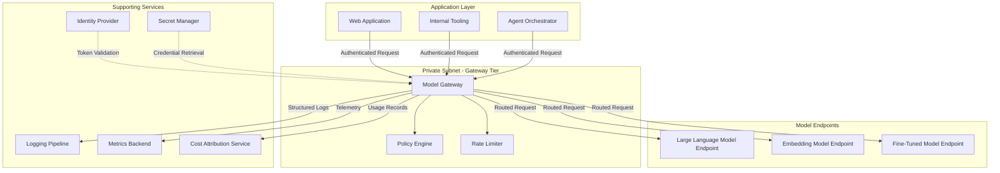

# Single-Cloud Architecture

## Overview

The single-cloud architecture deploys all generative AI components within one cloud provider's environment. It is the simplest reference topology in this framework: one network boundary, one identity plane, one set of native services for logging and monitoring, and one billing relationship. Organizations that have already standardized on a single cloud provider and whose data classification policies permit cloud-based model inference will find this architecture the most direct path from proof of concept to production.

Simplicity is the primary advantage. Every component shares the same network fabric, the same credential issuance chain, and the same control plane APIs. This eliminates the cross-cloud synchronization challenges that appear in multi-cloud and hybrid patterns. The trade-off is provider concentration risk: if the provider's model endpoints experience an outage or the provider discontinues a model, there is no automatic failover path.

## Architecture Diagram

## Network Topology

All components reside within a single virtual network. The gateway tier sits in a private subnet with no direct inbound access from the public internet. Application workloads reach the gateway through internal load balancers or service mesh routing. Model endpoints, whether managed inference services or self-hosted containers, reside in their own subnet segment and accept traffic only from the gateway tier.

Outbound internet access from the model subnet is restricted or eliminated entirely. If managed model endpoints require the provider's control plane for orchestration, those routes are allowlisted explicitly rather than granting broad egress. This reduces the blast radius if any component in the model tier is compromised.

A network firewall or security group layer enforces east-west segmentation between the application subnet, the gateway subnet, and the model subnet. No application workload communicates directly with a model endpoint; every request transits through the gateway.

## Gateway Placement

The model gateway is the single chokepoint through which all inference traffic flows. Placing it in a dedicated private subnet accomplishes three things:

1. **Uniform policy enforcement.** Every request, regardless of the calling application, passes through the same policy engine. Content filtering rules, token budget limits, and data classification checks are applied consistently.

2. **Credential isolation.** API keys and service credentials for model endpoints are stored in a secret manager and retrieved only by the gateway at request time. Application workloads never hold model-layer credentials, which limits the damage from a compromised application.

3. **Observability insertion point.** Because every request and response traverses the gateway, structured logs, latency metrics, token counts, and cost attribution records are emitted from a single location. This avoids the fragmented telemetry problem that arises when applications log their own model calls independently.

## Identity Integration

The identity provider serves as the root of trust for all authentication. Application workloads obtain short-lived tokens from the identity provider and present them to the gateway on every request. The gateway validates tokens, extracts claims such as team identifier and cost center, and uses those claims for authorization decisions and cost attribution downstream.

Service-to-service authentication between the gateway and model endpoints uses a separate credential path. The gateway retrieves endpoint-specific credentials from the secret manager, and those credentials are rotated on a schedule that is invisible to application consumers. This two-tier identity model ensures that a leaked application token cannot be used to call model endpoints directly.

## Agent Control Plane

For workloads that involve multi-step agent orchestration, where a language model calls tools, evaluates results, and iterates, the agent orchestrator sits in the application layer and communicates with the gateway like any other consumer. The gateway does not need to understand agent-specific semantics; it processes each inference call as an independent request.

However, the policy engine must be configured to handle the amplification characteristics of agent workloads. A single user action may trigger dozens of inference calls as the agent iterates. Rate limits and token budgets should be scoped at the session or task level, not just the per-request level, to prevent runaway agent loops from consuming disproportionate resources.

The logging pipeline should correlate agent traces end to end. Each request from the agent orchestrator should carry a session identifier that the gateway propagates into logs, enabling operators to reconstruct the full chain of inference calls that contributed to a single user-visible outcome.

## Design Decisions

### Why a dedicated gateway instead of direct SDK calls?

Direct SDK integration from applications to model endpoints is faster to prototype but creates ungovernable sprawl in production. Each application team implements its own retry logic, its own logging format, its own credential handling, and its own cost tracking. The gateway centralizes these cross-cutting concerns. The operational cost of running the gateway is far lower than the coordination cost of enforcing standards across dozens of application teams.

### Why private subnets for the gateway and model tiers?

Defense in depth. Even if an application workload is compromised, the attacker lands in the application subnet and faces network-level barriers before reaching the gateway or model endpoints. Combined with short-lived credentials and least-privilege access policies, the private subnet placement raises the cost of lateral movement.

### Why separate credentials for applications and model endpoints?

Credential scoping. Application tokens grant access to the gateway's API surface and nothing more. Model endpoint credentials grant access to inference APIs and nothing more. Neither credential set can be used to impersonate the other tier. If an application token leaks, the blast radius is limited to what the gateway's authorization layer permits for that token's claims.

### Why emit cost attribution from the gateway?

Accuracy and consistency. The gateway observes every request and response, including the actual token counts returned by model endpoints. Application-side estimates of token usage are unreliable because tokenization behavior varies across models. Gateway-side attribution captures the ground truth as reported by the model endpoint and tags it with the caller's identity claims in a single atomic log record.

### Why enforce rate limits at the gateway rather than the model endpoint?

Fairness across consumers. Model endpoint rate limits protect the endpoint from overload but do not distinguish between consumers. Gateway-level rate limiting allows differentiated quotas: a production-critical application can receive a higher allocation than an experimental notebook, even though both call the same underlying model endpoint. This also prevents a noisy neighbor in one team from degrading service for all other teams.

## Limitations

- **Provider concentration risk.** A region-wide outage at the cloud provider affects all model endpoints simultaneously. Organizations that require higher availability should consider the multi-cloud architecture.
- **Model catalog constraints.** You are limited to models available through that single provider's managed services or models you self-host within that provider's compute. If a critical model is only accessible through a different provider, this architecture cannot accommodate it without modification.
- **Scaling ceiling.** Managed inference endpoints have quota limits. Self-hosted model deployments require capacity planning. The single-cloud architecture does not inherently solve scaling; it only simplifies the operational surface on which scaling decisions are made.
